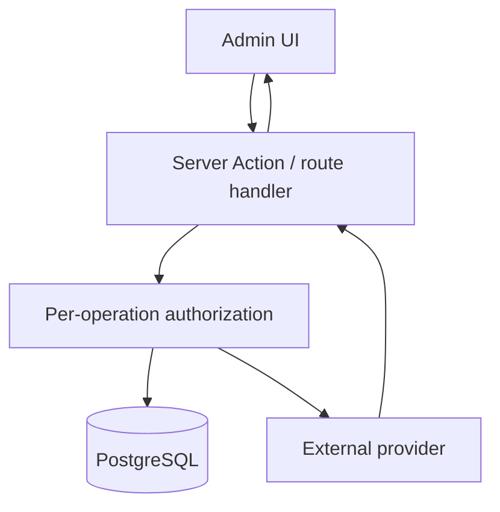

# Admin Operations Guide

Status: Source-backed map; production credentials/procedures UNKNOWN Source:
`src/app/admin/**`, `src/views/admin/**`, `src/actions/admin.ts`,
`src/actions/admin/**`, `src/lib/db/userUtils.ts` Last Verified: 2026-10-05
Confidence: HIGH for feature map; MEDIUM for authorization coverage Owner:
UNKNOWN Related Documents: [API catalog](API_CATALOG.md),
[auth security](AUTH_SECURITY.md), [operations runbook](OPERATIONS_RUNBOOK.md),
[Shiprocket note](shiprocket-admin-technical-doc.md)

## Access Model

Admin identity is represented by `users.role='admin'`; actions can also accept
`ADMIN_SYNC_TOKEN` where they call `isAuthorizedUser`. Admin role promotion can
be driven by `ADMIN_EMAILS` and legacy aliases. Do not assume that a visually
hidden route is protected: verify each action and route separately.
`/api/admin/sync-nav` currently has no local auth check.

## Admin Routes and Controls

| Route                         | Domain                 | Main operations / dependencies                                                                                 |
| ----------------------------- | ---------------------- | -------------------------------------------------------------------------------------------------------------- |
| `/admin`                      | Main dashboard         | User/account/AI/payment controls, data sync tools, NAV history sync; details distributed in components/actions |
| `/admin/shiprocket`           | Shiprocket operations  | Orders, tracking, shipment fulfillment, courier interaction, account context                                   |
| `/admin/shiprocket-accounts`  | Shiprocket accounts    | Multi-account CRUD/activation and credential handling                                                          |
| `/admin/shiprocket-customers` | Customer manager       | Historical sync, address book CRUD, dedupe and PII handling                                                    |
| `/admin/shiprocket-rates`     | Rates/serviceability   | Shipment-rate and postcode workflows                                                                           |
| `/admin/volumetric-weight`    | Operational calculator | Route/view exists; action/auth details require individual review                                               |
| `/admin/wood-calculator`      | Operational calculator | Route/view exists; intended operator workflow UNKNOWN                                                          |

Authorization is not centralized uniformly: verify each operation.
`/api/admin/sync-nav` currently lacks an in-handler auth check.

## Data and Sync Controls

- Mutual fund scheme/NAV sync paths are in `src/actions/admin/navSync.ts`,
  `navHistorySync.ts`, related runners and API routes.
- Vercel declares scheduled `/api/cron/sync-nav` and `/api/cron/sync-fii-dii`;
  `/api/cron/sync-daily-nav` is implemented but not declared as a Vercel cron.
- Payment settings and manual payment review are in `src/actions/payments.ts`
  and submodules.
- AI settings are stored in `ai_settings`; `src/actions/admin/ai.ts` manages
  provider/model/key/system prompt.
- Shiprocket credentials, cached auth tokens, customer PII, rates, and order
  data are handled in `src/actions/admin/shiprocket*.ts`.

## Operational Safety

- Do not paste provider credentials or customer PII into public issues/docs.
- Before history sync or destructive data maintenance, confirm DB backup and
  targeted date range; repository does not document an operator rollback
  procedure.
- Review returned sync counts, market watermark and per-source errors; partial
  success can be returned as `ok: true` with nested error values.
- Confirm secret environment names via `ENVIRONMENT_VARIABLES.md`; do not use
  ignored secret files as the source of operational truth.

A definitive role-permission matrix, audit-log policy, change approval flow,
production admin roster, escalation contacts, and break-glass procedure are NOT
FOUND. Owner: UNKNOWN.
