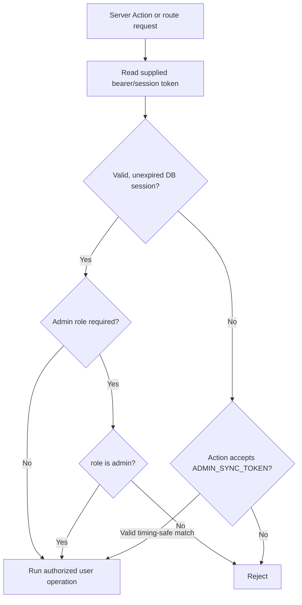

# Authentication and Authorization

Status: Source-backed; threat-model and production configuration review
outstanding Source: `src/actions/auth/**`, `src/lib/db/userUtils.ts`,
`src/lib/db/cryptoUtils.ts`, `src/utilities/clientSession.ts`,
`src/context/auth/`, `src/actions/payments/` Last Verified: 2026-10-05
Confidence: HIGH for local flow Owner: UNKNOWN Related Documents:
[Security architecture](SECURITY_ARCHITECTURE.md),
[privacy governance](DATA_PRIVACY_AND_GOVERNANCE.md),
[admin guide](ADMIN_OPERATIONS_GUIDE.md)

## Authentication Methods

- Password signup/login uses email plus PBKDF2-SHA256 (100,000 iterations,
  16-byte random salt, 256-bit output). Email is normalized/lowercased; login
  constrains input lengths and validates email syntax. Evidence:
  `src/lib/db/cryptoUtils.ts`, `src/actions/auth/loginHandlers.ts`,
  `src/actions/auth/googleSignup.ts`.
- Google login sends the credential to Google tokeninfo server-side, checks
  `email_verified`, then creates/updates the local user. The inspected code does
  not visibly compare the returned `aud` claim to
  `NEXT_PUBLIC_GOOGLE_CLIENT_ID`; confirm whether the provider verification
  contract is sufficient and add an explicit audience check in a separately
  authorized security change. Evidence: `src/actions/auth/authHelpers.ts`.
- Successful auth creates a random two-UUID token and a 30-day `user_sessions`
  database row. The browser persists it as `auth_token` in `localStorage`;
  server actions receive it as an argument. It is not an
  HttpOnly/Secure/SameSite cookie. Evidence: `src/actions/auth/authHelpers.ts`,
  `src/utilities/clientSession.ts`.
- Password reset, MFA, email verification for password accounts, and session
  rotation/revocation on password change were NOT FOUND in inspected source.

## Authorization

### Authentication Flow

```mermaid
sequenceDiagram
  participant B as Browser
  participant A as Auth Server Action
  participant G as Google tokeninfo (Google login only)
  participant DB as PostgreSQL
  B->>A: credentials or Google ID token
  opt Google login
    A->>G: verify id_token
    G-->>A: email/profile/verified status
  end
  A->>DB: lookup/create user; insert 30-day session
  DB-->>A: user/session
  A-->>B: token + mapped user
  B->>B: store auth_token in localStorage
```

### Authorization Flow



This depicts the shared helper pattern only. Individual server actions and
routes vary; some have no visible auth check.

- `getUserFromToken` strips an optional Bearer prefix, selects a non-expired
  session, and joins the user row.
- `isAuthorizedUser` accepts either a timing-safe comparison against
  `ADMIN_SYNC_TOKEN` or a session whose DB `role` is `admin`.
- `isEmailAdmin` promotes matching emails using a comma-separated list from
  `ADMIN_EMAILS`, then public/legacy aliases `NEXT_PUBLIC_ALLOWED_EMAIL` or
  `VITE_ALLOWED_EMAIL`. Password login and Google login both apply this
  behavior.
- Admin route pages may be client gated, but client gating is not a substitute
  for server/action authorization. Each mutation must be verified individually.
- Cron routes use `CRON_SECRET` checks. `/api/admin/sync-nav` currently has no
  auth check in its route handler.

## Usage/Subscription State

`FREE_USAGE_LIMIT` is 15 and `TRIAL_DURATION_HOURS` is 48 in DB types.
`trackUsageAction` initializes trial timestamps, increments usage for `api`
calls, and checks subscription/trial/free limit. Admins bypass blocking.
`isUserBlocked` checks subscription expiration and quota; exact client call
sites determine which actions consume quota.

## Security Risks

1. Browser local storage bearer tokens are available to injected same-origin
   JavaScript; the CSP still includes `unsafe-inline` and `unsafe-eval`. Treat
   XSS impact as elevated.
2. Email allowlist promotion and admin token fallback need deployment-secret
   governance and explicit server-side review.
3. Google audience validation, session token lifecycle, and per-action auth
   coverage need independent security tests.
4. Payment verification has a plan/order binding concern described in
   `SECURITY_FINDINGS.md`.
5. The published privacy policy's account/data statements do not match persisted
   state; legal/privacy review is required.

No MFA, central identity provider, or role-permission matrix was found. Owner of
these controls is UNKNOWN.
