# Database ERD

Status: Derived from migration DDL; deployed schema NOT VERIFIED Source:
`src/lib/db/*Migrations.ts` Last Verified: 2026-10-05 Confidence: HIGH for
declared relationships; MEDIUM for final NAV table shape Owner: UNKNOWN Related
Documents: [Database architecture](DATABASE_ARCHITECTURE.md),
[data dictionary](DATABASE_DATA_DICTIONARY.md)

```mermaid
erDiagram
  USERS ||--o{ USER_SESSIONS : owns
  USERS ||--o{ PAYMENT_SUBMISSIONS : submits
  USERS ||--o{ USER_STRATEGIES : saves
  USERS ||--o{ PPF_INVESTMENTS : records
  USERS ||--o{ PPF_PREFERENCES : configures
  SHIPROCKET_CUSTOMERS ||--o{ SHIPROCKET_CUSTOMER_ORDERS : aggregates
  USERS {
    text id PK
    text email UK
    text role
    text subscription_status
    text subscription_plan
  }
  USER_SESSIONS {
    text token PK
    text user_id FK
    timestamptz expires_at
  }
  PAYMENT_SUBMISSIONS {
    text id PK
    text user_id FK
    text utr_ref
    numeric amount
    text status
  }
  USER_STRATEGIES {
    text user_id PK
    text id PK
    jsonb config
    timestamptz deleted_at
  }
  MUTUAL_FUND_SCHEMES {
    text scheme_code PK
    text scheme_name
    jsonb payload
  }
  MUTUAL_FUND_NAV {
    text scheme_code
    date date
    numeric nav
  }
  INFLATION_SOURCES {
    text source PK
    jsonb payload
  }
  SHIPROCKET_ACCOUNTS {
    text id PK
    text api_email
    text api_password
    text auth_token
  }
  SHIPROCKET_CUSTOMERS {
    text id PK
    text dedup_key UK
    text customer_phone
    text customer_address
  }
  SHIPROCKET_CUSTOMER_ORDERS {
    text dedup_key PK
    text account_id PK
    text order_id PK
    timestamptz order_date
  }
  PPF_INVESTMENTS {
    text id PK
    text user_id FK
    text guest_id
    date investment_date
    numeric amount
  }
  PPF_PREFERENCES {
    text id PK
    text user_id FK
    text guest_id
    numeric projected_rate
  }
  GAME_LEADERBOARD {
    text id PK
    text user_id
    text game_id
    integer total_points
  }
  GAME_SESSIONS {
    text id PK
    text owner_id
    text game_id
    timestamptz consumed_at
  }
  USER_APP_STATE {
    text user_id PK
    text namespace PK
    text state_key PK
    jsonb payload
  }
  TRACKED_SCHEMES {
    varchar scheme_code PK
    boolean is_active
  }
  INSTITUTIONAL_FLOWS {
    date trade_date PK
    numeric fii_net_crores
    numeric dii_net_crores
  }
  INDEX_PRICES {
    date trade_date PK
    varchar index_name PK
    numeric close_price
  }
  MACRO_INDICATORS {
    date record_date PK
    numeric cpi_index
    numeric ppp_factor
  }
```

The diagram includes only declared FK lines where present.
`SHIPROCKET_CUSTOMER_ORDERS` uses a logical dedup-key reference without a
declared FK. PPF guest ownership, game owner IDs, and `user_app_state` have no
declared user FK. The mutual-fund NAV table is recreated by
`trackedSchemesMigrations.ts`; verify its deployed shape before applying this
ERD operationally.
