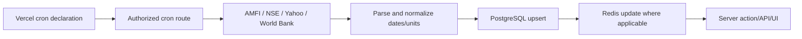
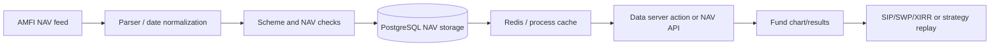

# Data Sources and Provenance

Status: Source-backed inventory; provider terms and live responses not
independently validated Source: `src/actions/data/`, `src/lib/amfi/`,
`src/lib/fiiDii/`, `src/actions/admin/`, `src/data/api/`,
`src/utils/razorpay.ts` Last Verified: 2026-10-05 Confidence: HIGH for
code-declared URLs and transformations; MEDIUM/LOW for legal/provider semantics
Owner: UNKNOWN Related Documents: [Data freshness](DATA_FRESHNESS.md),
[database architecture](DATABASE_ARCHITECTURE.md), [API catalog](API_CATALOG.md)

## Source Inventory and Lineage

| Source/provider | Code endpoint/dataset                                                                           | Ingestion and transformation                                                                 | Storage/cache/UI                                                                                            | Auth/limits/failure                                                                            | Confidence and gaps                                                                                                                        |
| --------------- | ----------------------------------------------------------------------------------------------- | -------------------------------------------------------------------------------------------- | ----------------------------------------------------------------------------------------------------------- | ---------------------------------------------------------------------------------------------- | ------------------------------------------------------------------------------------------------------------------------------------------ |
| AMFI India      | `https://portal.amfiindia.com/spages/NAVAll.txt`; historical `DownloadNAVHistoryReport_Po.aspx` | Parse scheme/NAV text, date normalization, scheme whitelisting/auto-inclusion, batch upserts | `mutual_fund_schemes`, `mutual_fund_nav`, Redis/process cache; mutual fund views and `/api/nav/:schemeCode` | Public upstream; bounded timeout/backoff in NAV path; stored NAV can serve stale/fallback data | Code calls this “official AMFI”; exact current access terms, release timing and row-level provenance are not stored with every observation |
| MFAPI           | `https://api.mfapi.in/mf/{schemeCode}`                                                          | Auto-inclusion/backfill fallback in `src/lib/amfi/autoInclusion.ts`                          | AMFI NAV repository/storage                                                                                 | No app authentication; fetch timeout 30s in this path                                          | Provider agreement/reliability NOT VERIFIED; distinguish from primary AMFI source                                                          |
| World Bank PPP  | Indicator `PA.NUS.PPP`; both all-country latest-value endpoint and India annual series          | JSON records normalized to country/year mappings; app has bundled defaults                   | `inflation_sources`, in-memory and Redis; PPP and FII/DII adjustment UI                                     | No app auth; timeouts/revalidation vary by path; fallback bundled datasets                     | Dataset reference is code-visible; retrieval date/version not persisted per value                                                          |
| World Bank CPI  | `FP.CPI.TOTL` and `FP.CPI.TOTL.ZG` in separate paths                                            | Annual index or percent series parsing; date-bounded queries in FII/DII fetcher              | FII/DII `macro_indicators`, client inflation data import                                                    | No auth; cache behavior differs by fetcher                                                     | Different indicators/units are used in different subsystems; do not conflate index with annual rate                                        |
| IMF DataMapper  | `https://www.imf.org/external/datamapper/api/v1/PCPIPCH/IND/USA/EU/WEOWORLD`                    | Passes provider JSON through action; cache/read behavior below                               | `inflation_sources` and Redis; inflation UI                                                                 | No auth; timeout on fetch; fetch failure returns empty PCPIPCH structure                       | In action code, a stored value is returned without an age check; effective freshness UNKNOWN                                               |
| Open ER         | `https://open.er-api.com/v6/latest`                                                             | USD-base rates checked for object shape                                                      | PostgreSQL `inflation_sources`, process memory, Redis; currency converter                                   | No auth; 6s timeout; stale DB then static fallback                                             | Provider exact plan/terms and rate source methodology NOT VERIFIED                                                                         |
| NSE India       | `/api/fiidiiTradeReact`, fallback `/api/fiidii` on `www.nseindia.com`                           | Cookie priming, parse FII/FPI and DII buy/sell; net = buy - sell rounded to 2 decimals       | `institutional_flows` and FII/DII tracker                                                                   | No API key; session/cookie and User-Agent; errors logged and cron returns partial result       | Endpoint is consumed as an observed public API; formal provider contract not found                                                         |
| Yahoo Finance   | chart API for `^NSEI`, `^BSESN`                                                                 | Close prices and timestamps normalized, daily close values rounded to 2 decimals             | `index_prices`, FII/DII chart                                                                               | No auth; Vercel fetch revalidate 1 hour in this path                                           | Not an exchange-authoritative feed in repository; terms/accuracy NOT VERIFIED                                                              |
| Shiprocket      | `https://apiv2.shiprocket.in/v1/external/...`                                                   | Account auth, order/customer/rate/fulfillment responses mapped to local types/cache          | Shiprocket actions, account/customer/order tables, Redis                                                    | Credentials from account DB or environment aliases; provider token refreshed by client module  | Customer PII and stored credentials are sensitive; provider API claims in old docs not live-verified in this audit                         |
| India Post      | `https://api.postalpincode.in/pincode/{pincode}`                                                | Pincode -> locality/state lookup                                                             | Admin Shiprocket rate/address workflows                                                                     | Public endpoint; exact rate limits/failure fallback vary                                       | Provider behavior not independently tested                                                                                                 |
| Google OAuth    | `https://oauth2.googleapis.com/tokeninfo?id_token=...`                                          | Server verifies returned token information and checks verified email                         | User/session DB                                                                                             | 6s timeout; client ID audience comparison is not visible in inspected flow                     | Audience/issuer claims should be independently reviewed                                                                                    |
| Google Gemini   | `https://generativelanguage.googleapis.com/v1beta/models/{model}:generateContent`               | Text prompt built from DB system prompt, serialized financial summary and user question      | Response returned to client; logs provider error body                                                       | API key via `x-goog-api-key`; 25s timeout; max 1500 tokens, temperature 0.3                    | No response schema/source citation validation found; data is sent to external processor                                                    |
| Razorpay        | `https://api.razorpay.com/v1/orders`, Checkout JS                                               | Creates order, verifies HMAC signature, then updates subscription DB                         | `payment_submissions`, `users`; browser checkout                                                            | Server key/secret; key ID may have public aliases; response error messages returned            | Order amount/plan binding needs review; details in security findings                                                                       |
| Vercel Blob     | Vercel SDK private note paths                                                                   | Deterministic `notes/{userId}/{noteId}.txt` path; private writes; SDK read                   | Note content may exist in both DB `content` and blob URL flow; Redis cache used by note actions             | `BLOB_READ_WRITE_TOKEN`; DB fallback behavior                                                  | Exact active production storage mode and retention UNKNOWN                                                                                 |
| Dicebear        | `https://api.dicebear.com/7.x/initials/svg?seed=...`                                            | Avatar URL built for fallback profile image                                                  | Profile image URL                                                                                           | Public URL, seed includes display name/email-derived text                                      | User data in request URL is provider-visible; policy disclosure should cover if used                                                       |
| GA4             | `window.gtag('event', ...)` when present                                                        | Emits calculator name/action/label/value                                                     | External analytics endpoint configured elsewhere or not enabled                                             | Tag injection not located/verified in this audit                                               | Production enablement UNKNOWN; privacy page currently denies GA use                                                                        |

## Scheduled Ingestion Flow

Only NAV and FII/DII schedules are declared in `vercel.json`; this is a
conceptual path, not evidence that every source is refreshed by cron.

## Provenance Gaps

- Most persisted data rows do not store source URL, fetched-at timestamp,
  upstream response version, transformation version, or confidence alongside the
  value.
- FII/DII macro fallback constants (`CPI 233.0`, `PPP 23.85`) are coded in
  `src/lib/fiiDii/fiiDiiCalculations.ts`; source/effective date are not attached
  to the fallback.
- PPF historical rates are in `src/data/ppfRates.ts`; the comments attribute
  them to government notifications, but source URLs/documents are absent.
- Tax rules and forward scenario profiles are hardcoded; legal/statistical
  provenance is not attached.
- Fallback datasets in `src/data/default_*` need their own dated source ledger;
  source files alone do not establish freshness.

## Data Lineage Example

No flow from financial data to AI is implied in this diagram. Tax AI input flow
is described separately in `AI_ARCHITECTURE.md`.
