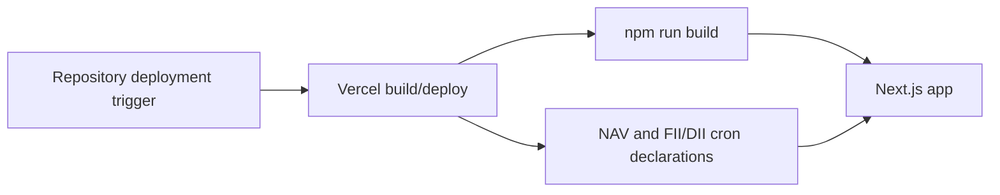

# DevOps Guide

Status: Based on checked-in configuration; live Vercel settings NOT VERIFIED
Source: `vercel.json`, `next.config.ts`, `package.json`,
`src/lib/db/migrations.ts` Last Verified: 2026-10-05 Confidence: MEDIUM Owner:
UNKNOWN Related Documents: [Deployment guide](DEPLOYMENT_GUIDE.md),
[operations runbook](OPERATIONS_RUNBOOK.md),
[environment variables](ENVIRONMENT_VARIABLES.md)

## Declared Platform

`vercel.json` declares `framework: nextjs`, a 30-second function maximum,
rewrites, redirects, security headers, static-asset cache headers, and two cron
jobs. Neon PostgreSQL, Upstash Redis, Vercel Blob, and provider APIs are code
dependencies. Actual project linkage, regions, environment scopes, secrets,
build settings, and production resource limits are REQUIRES HUMAN CONFIRMATION.

## Build and Test

`npm ci`, `npm run lint`, `npm test`, and `npm run build`. No checked-in GitHub
Actions workflow or other CI pipeline file was found. Storybook commands are
available. Ensure tests that depend on databases/providers are understood before
interpreting a green suite.

## Database Operations

Schema creation/upgrades are invoked by `ensureTables()` at runtime. Version
is 18. Migrations are multi-module and not shown in a single transaction. Before
schema changes: capture a provider backup/branch, inspect live version and table
columns, test upgrade on a copy, and define rollback. No migration rollback tool
was found.

No checked-in CI pipeline was found; the Git-to-Vercel trigger/approval details
are deployment-dependent and UNKNOWN.

## Secrets and Cron

Configure variables by environment using a secret manager/Vercel settings, not
source files. Cron routes depend on `CRON_SECRET`; NAV and FII/DII jobs are
declared in `vercel.json`. Confirm the configured secret and actual cron
invocation out of band. Do not put secrets in query strings.
