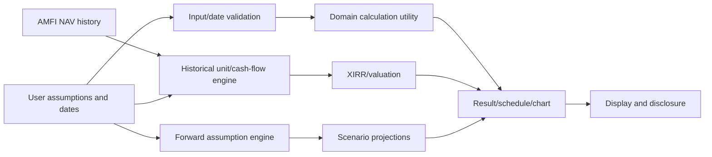

# Financial Calculation Catalog

Status: Source-level catalog; no independent actuarial/tax/legal certification
Source: `src/utilities/`,
`src/views/{emi,fd,rd,nps,ppf,income-tax,property-tax,mutual-fund,strategy}/`,
`src/lib/fiiDii/fiiDiiCalculations.ts` Last Verified: 2026-10-05 Confidence:
HIGH for described code paths; correctness against current law/provider rules
varies Owner: UNKNOWN Related Documents:
[Financial calculation audit](FINANCIAL_CALCULATION_AUDIT.md),
[test matrix](FINANCIAL_TEST_MATRIX.md),
[data provenance](DATA_SOURCES_AND_PROVENANCE.md)

Amounts are generally JavaScript `number`s; rounding is performed in individual
functions/UI, not under a single decimal-money abstraction.
Inputs/defaults/limits are spread across components and state hooks. Unless
noted, server persistence is not required to perform the calculation.

| Calculation                                  | Implementation and formula/model                                                                                                                                                                                                                        | Inputs/outputs and assumptions                                                                                                                                                    | Tests/evidence                                                                          |
| -------------------------------------------- | ------------------------------------------------------------------------------------------------------------------------------------------------------------------------------------------------------------------------------------------------------- | --------------------------------------------------------------------------------------------------------------------------------------------------------------------------------- | --------------------------------------------------------------------------------------- |
| Generic compound interest / target principal | `src/utilities/utility.ts`: `A=P(1+r/f)^(f*m/12)`; earned interest `A-P`; inverse target principal `P=A/(1+r/f)^(f*m/12)`                                                                                                                               | principal/target, annual percent, compounding frequency, tenure months, payout mode interval; sanitizes via `sanctnum`; frequency and rate interpretation depend on UI values     | No dedicated utility test identified                                                    |
| Home SIP quick simulator                     | `HomeWealthSimulator.tsx`: sums `contribution*(1+annualRate/12)^(months-i+1)` for monthly contributions                                                                                                                                                 | monthly amount, annual expected return, years; deposits effectively receive at least one month of growth in this exponent convention; rounds output to rupees                     | `src/views/home/HomeWealthSimulator.tsx`                                                |
| Fixed-rate SIP / target SIP                  | `fixed-rate-sip/useFixedRateSip.ts`: sums monthly contribution factors under monthly compounding; target mode divides target by sum                                                                                                                     | Monthly contribution/target, annual ROI, months/years; payout rounded up; model is deterministic                                                                                  | no dedicated tests identified                                                           |
| Mutual-fund lump sum                         | Unit-based valuation at actual NAV observations; units = amount/NAV; value = units × NAV                                                                                                                                                                | AMFI NAV history; NAV date selection via nearest-date helper                                                                                                                | Mutual-fund modules and strategy tests                                                  |
| NAV-based SIP                                | `calculateSip`: monthly schedule; each payment buys `amount/NAV`; step-up factor `(1+stepUp/100)^floor(index/12)`; return XIRR                                                                                                                          | start/end dates, monthly amount, annual step-up, installment day, NAV data; missing monthly NAV dates are skipped                                                                 | `src/utilities/mutual-fund/sipCalculations.ts`, NAV/date tests                          |
| NAV-based SWP                                | Initial corpus buys units at effective start NAV; withdrawals sell `amount/NAV`; stops when requested withdrawal units exceed remaining units; terminal portfolio value added to XIRR flows                                                             | initial principal, withdrawal start/end, monthly amount, annual step-up, installment day, NAV data                                                                                | `src/utilities/mutual-fund/swpCalculations.ts`                                          |
| XIRR                                         | Newton iteration starting at 10%, up to 100 iterations; day fractions use 365.25 days/year; return when rate delta <1e-10, otherwise residual tolerance 0.01                                                                                            | Dated cash flows; may fail to converge or select one of multiple roots; rates must remain greater than -100%                                                                      | `src/utilities/mutual-fund/xirrCalculation.ts`                                          |
| FD payout/maturity and tax estimate          | `useFdCalculations` calls generic compound-interest helpers; applies a simplified slab percent × 1.04 estimate, TDS threshold display, 80TTB senior estimate, post-tax CAGR                                                                             | principal/target, ROI, compounding/payout mode, tenure, user tax slab/senior status; tax is an estimate, not return calculation                                                   | `src/views/fd/useFdCalculations.ts`; no dedicated tests found                           |
| RD                                           | Monthly deposit terms are compounded using quarterly nominal rate factors `(1+r/4)^(4*monthsLeft/12)`; target mode divides desired maturity by sum of factors and rounds payment up                                                                     | monthly deposit/target, annual rate, tenure, quarterly compounding approximation                                                                                                  | `src/views/rd/useRdCalculations.ts`; no dedicated tests found                           |
| EMI                                          | Base EMI `P*i*(1+i)^n / ((1+i)^n-1)`, where `i=annualRate/1200`; schedule separately replays monthly interest, rate changes, part payments, date/prorated first installment                                                                             | principal, annual rate, months, disbursement date, EMI day, part payments, rate changes, first-payment treatment                                                                  | `src/views/emi/calculateBaseEmi.ts`, `calculateAmortization.ts`, tests not found        |
| PPF                                          | FY/month schedule; interest rate/12 on eligible balance, where deposits on/before 5th count for the month; monthly interest sums and is credited/rounded annually; deposit capped at ₹150,000 per FY; opening FY plus 15 complete FYs, extension blocks | frequency, deposit amount/timing, start FY, recorded entries, extension mode, projected rate, as-of date; default projected rate 7.1%; validation/UI limits live in several files | `src/utilities/ppfCalculations.ts`, `ppfRates.ts`, PPF tests                            |
| PPF-vs-mutual-fund comparison                | Replays each recorded deposit into selected fund at nearest available NAV; units sum and value at latest NAV; computes absolute gain/percent and XIRR; compares against PPF current balance                                                             | historical PPF entries, NAV history, scheme code/name, calculated PPF state; dates before NAV inception fall back to earliest row and warn                                        | `src/utilities/ppfMutualFundComparison.ts`, test file                                   |
| NPS                                          | Monthly recurrence `(corpus + contribution)*(1 + annualROI/1200)`; split total corpus by annuity percent; simple pension estimate `annuityCorpus*annuityRate/100/12`                                                                                    | age, retirement age, self/employer monthly contribution, expected ROI, annuity rate/percent; hardcoded exit threshold and annuity minimum rules                                   | `src/utilities/npsCalculations.ts`; no dedicated test found                             |
| Income tax / regime comparison               | Slab calculation, salary/HRA/property income, deductions, equity STCG/LTCG tax, rebate, surcharge and 4% cess; binary search estimates break-even deductions                                                                                            | FY 2023-24 and other supported FY values; deduction caps/rates hardcoded; numbers rounded to rupees in returned results                                                           | `src/utilities/income-tax/**`, `incomeTaxCalculations.ts`; test coverage not identified |
| Inflation price adjustment                   | Compounds annual percentage series between start/end years; also divides principal by each rate factor for inverse figure                                                                                                                               | principal, years, place, dataset rows; missing (`n/a`) years omitted                                                                                                              | `src/utilities/inflationUtils.ts`; validate direction/interpretation per UI             |
| PPP amount conversion                        | `targetAmount=(sourceAmount/sourcePPP)*targetPPP`; latest available year key per country                                                                                                                                                                | amount and source/target PPP factors from World Bank/default datasets                                                                                                             | `src/views/ppp/pppUtils.ts`                                                             |
| Currency conversion                          | UI uses USD-base rates and normalizes source/target via rate map; formatting helpers use Intl and symbol list                                                                                                                                           | amount, currencies, returned rates; fallback rate dataset available                                                                                                               | `src/views/currency-converter/`, `src/actions/data/exchangeRatesHandler.ts`             |
| FII/DII nominal/real/PPP                     | Real flow `nominal*(latestCPI/historicalCPI)`; PPP flow `nominal/historicalPPP`; cumulative totals sum adjusted point values                                                                                                                            | date-indexed flows, CPI, PPP, selected mode and timeframe; fallback constants exist when macro history missing                                                                    | `src/lib/fiiDii/fiiDiiCalculations.ts`                                                  |
| Historical strategy                          | Plans dated transactions, resolves each to actual NAV on/before date, converts rupees to units, replays sales/SIPs/SWPs and values at actual NAV                                                                                                        | selected funds, transaction schedules, NAV book, as-of date; no assumed return in historical replay                                                                               | `src/views/strategy/engine.ts`, `executor.ts`, `timeline.ts`, tests                     |
| Strategy projection                          | Extends NAVs under empirical-window return bands/scenarios, reuses transaction engine, can deflate values by inflation assumption                                                                                                                       | horizon 10-100 years; weak/median/strong profiles hardcoded; default inflation 6%; profile statistical provenance is not linked in code                                           | `src/views/strategy/projection*`, tests                                                 |
| Property tax / capital gains                 | UI and constants implement tax modeling; exact law-sensitive formulas are distributed across `src/views/property-tax/**` and income-tax utilities                                                                                                       | Inputs and choices are view-specific; this catalog does not certify legal interpretation                                                                                          | Human tax reviewer needed; property-tax details pending focused source specification    |

## Calculation Flow

Historical NAV-based calculation and assumption-based projection are distinct
paths; do not describe projected values as historical outcomes.

## FIRE / Retirement Scope

A dedicated FIRE-number, Coast FIRE, Lean/Fat/Barista FIRE, or
sequence-of-returns retirement engine was NOT FOUND. The product has fixed-rate
SWP, NPS retirement wording, strategy withdrawal projections, and long-horizon
scenarios. Do not describe these as a standalone FIRE methodology.
