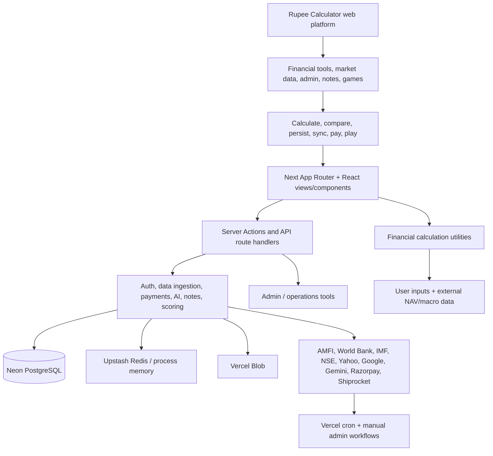

# Project Master Map

Status: Current-state map from repository evidence Source: `src/app/`,
`src/actions/`, `src/lib/`, `src/utilities/`, `src/views/`, `db/`, `vercel.json`
Last Verified: 2026-10-05 Confidence: HIGH for source topology; production state
UNKNOWN Owner: UNKNOWN Related Documents: [System design](SYSTEM_DESIGN.md),
[feature inventory](PRODUCT_AND_FEATURE_INVENTORY.md),
[documentation index](DOCUMENTATION_INDEX.md)

## Domain Map

- **Product routes:** 48 page files under `src/app`; machine-readable list:
  `inventory/route-inventory.json`.
- **Frontend:** app shell, reusable controls, calculator-specific views, games,
  styles/design tokens.
- **Financial engine:** pure/shared utilities plus view-local engines; formula
  catalog/audit in `FINANCIAL_CALCULATION_CATALOG.md` and
  `FINANCIAL_CALCULATION_AUDIT.md`.
- **External data:** AMFI, Open ER, World Bank, IMF, NSE, Yahoo; data
  lineage in `DATA_SOURCES_AND_PROVENANCE.md`.
- **Backend:** Next server actions and seven route handler files; API inventory
  in `API_CATALOG.md` and JSON.
- **Persistence:** Neon/PostgreSQL runtime migrations; full table list in
  `DATABASE_DATA_DICTIONARY.md`.
- **AI:** one Gemini tax advice flow, not a generalized AI platform.
- **Admin:** app user/data controls and Shiprocket operations, authorization
  varies per action.
- **Operations:** Vercel-declared NAV/FII-DII cron jobs; live schedules/config
  NOT VERIFIED.

## End-to-End Example: NAV-Backed SIP

`/mutual-funds/sip` -> scheme search/NAV server action -> Redis/process cache ->
PostgreSQL or AMFI fetch -> NAV series returned -> client-side unit
purchases/XIRR -> chart/result UI. Tests exist around NAV parsing/date logic and
strategy, but every displayed financial result still needs domain-specific
oracle validation.

## Known Boundaries

Client-only mathematical tools coexist with server-persisted user financial
records and server-forwarded AI requests; avoid describing the whole app as
client-only. Game architecture shares auth/database/cache but remains a separate
bounded context. Production owners, SLAs, legal approvers, and deployment
settings are UNKNOWN.
