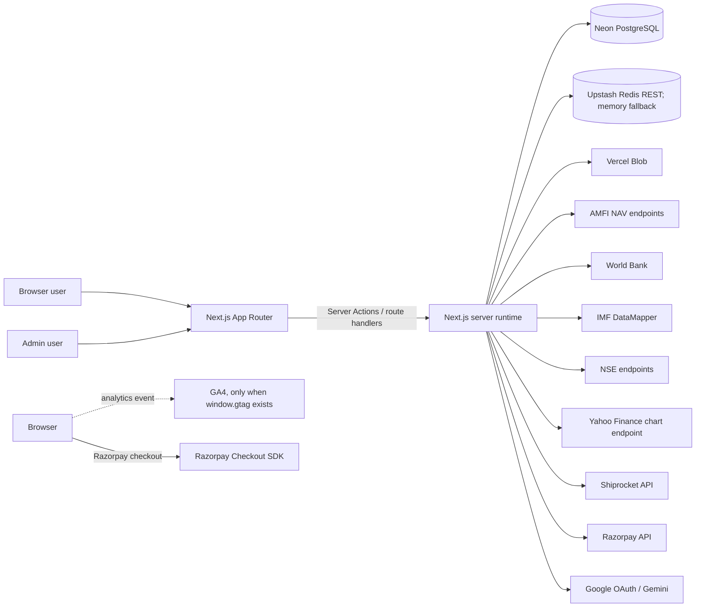
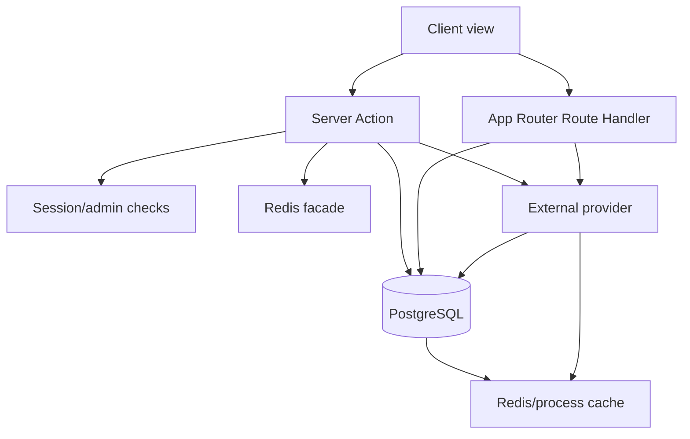
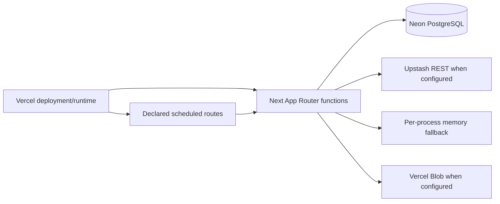
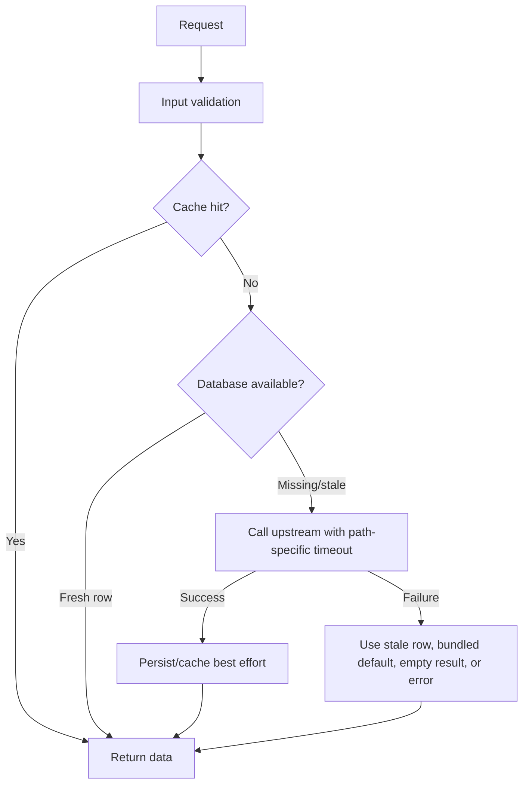

# System Design

Status: Draft, source-backed Source: `package.json`, `src/app/layout.tsx`,
`src/components/AppClientLayout.tsx`, `src/actions/`, `src/app/api/`,
`src/lib/`, `src/lib/db/`, `vercel.json` Last Verified: 2026-10-05 Confidence:
HIGH for source-level topology; MEDIUM for deployed topology Owner: UNKNOWN
Related Documents: [API catalog](API_CATALOG.md),
[database architecture](DATABASE_ARCHITECTURE.md),
[auth and security](AUTH_SECURITY.md),
[data provenance](DATA_SOURCES_AND_PROVENANCE.md)

## Context

Rupee Calculator is a Next.js 16 App Router application, with React 19 and
TypeScript. It combines browser-driven financial tools with server actions and
route handlers for identity, persistence, external data, admin workflows, and
integrations. `package.json` declares Next `^16.3.4`, React `^19.2.8`,
TypeScript `~6.0.3`, Neon serverless PostgreSQL, Vercel Blob, and Recharts/AG
Charts.

## System Context

## Containers and Boundaries

| Boundary          | Implemented responsibility                                                                                        | Evidence                                                                             | Confidence                              |
| ----------------- | ----------------------------------------------------------------------------------------------------------------- | ------------------------------------------------------------------------------------ | --------------------------------------- |
| Browser UI        | App routes, client-side calculator state and arithmetic, charts, controls, local session token and guest identity | `src/app/**/page.tsx`, `src/views/`, `src/utilities/clientSession.ts`                | HIGH                                    |
| App shell         | Auth and sidebar providers, top bar, route tracking, loading boundary, progress bar, paywall modal                | `src/app/layout.tsx`, `src/components/AppClientLayout.tsx`                           | HIGH                                    |
| Server actions    | Typed function entry points for auth, data, payments, notes, tax AI, admin, PPF history, games                    | `src/actions/**`                                                                     | HIGH                                    |
| Route handlers    | NAV API, cron sync, admin single-day NAV sync, and legacy leaderboard endpoint                                    | `src/app/api/**/route.ts`                                                            | HIGH                                    |
| Database          | Neon PostgreSQL via `@neondatabase/serverless`; SQL tagged templates and runtime migrations                       | `src/lib/db.ts`, `src/lib/db/migrations.ts`                                          | HIGH                                    |
| Cache             | Upstash REST when configured/reachable; process-local fallback                                                    | `src/lib/redis.ts`, `src/lib/redis/upstashClient.ts`, `src/lib/redis/memoryStore.ts` | HIGH                                    |
| Object storage    | Vercel Blob for note-body operations, with DB-backed note content also present in schema/actions                  | `src/lib/blob.ts`, `src/actions/notes/**`                                            | HIGH                                    |
| Hosting/schedules | Vercel framework, two declared cron schedules, rewrites, redirects, headers, max duration 30s                     | `vercel.json`                                                                        | HIGH for declaration; NOT VERIFIED live |

## Frontend Architecture

The root App Router layout imports global SCSS, root metadata/viewport, and
JSON-LD. It wraps route content in client `AppClientLayout`, which mounts
`AuthProvider`, `SidebarProvider`, a route tracker, navigation progress UI,
sticky top bar, web sidebar, Suspense loading fallback, and paywall modal.
Calculator and game implementations are predominantly under `src/views/`; route
files under `src/app/` are generally entry wrappers. Rendering mode for every
individual route has not been independently measured; do not infer static
generation from a source page file.

State is primarily component hooks and context (`src/context/`). Persistent
state varies by feature: local storage guest/auth tokens, client-side saved
strategy library with server synchronization, database-backed PPF
records/preferences, and database-backed notes/payment/admin data.

## Backend and Data Flow

The NAV pipeline is a prominent example: AMFI data is parsed by `src/lib/amfi/`,
persisted using repositories/storage helpers, surfaced through server actions
and `/api/nav/:schemeCode`, and refreshed by Vercel cron routes. FII/DII flows,
indices, and macro indicators use separate fetcher/repository/migration modules.

## Security Architecture Summary

- User session tokens are generated server-side, stored in `user_sessions`,
  returned to the browser, and read from local storage
  (`src/actions/auth/authHelpers.ts`, `src/utilities/clientSession.ts`). They
  are not HttpOnly cookies.
- Admin role checks use session users; selected server actions also accept
  `ADMIN_SYNC_TOKEN` through `isAuthorizedUser` (`src/lib/db/userUtils.ts`).
- Two cron routes require `CRON_SECRET`; `sync-fii-dii` also accepts a query
  parameter secret. `/api/admin/sync-nav` currently has no visible auth gate.
- Security headers and CSP are declared in both `next.config.ts` and
  `vercel.json`; live deployment behavior is NOT VERIFIED.
- Tax AI sends a client-provided financial summary and question to Gemini after
  a Tax Pro/admin check (`src/actions/taxAi.ts`).

## Deployment and Observability

`vercel.json` declares daily NAV sync at 02:30 UTC and weekday FII/DII sync at
12:35 UTC, and sets a 30-second function limit. No checked-in CI workflow was
found in the inspected repository. Logging is primarily `console.warn/error`;
metrics, tracing, alert configuration, backup policy, restore drills, and
production health-check ownership are UNKNOWN/NOT FOUND in repository
configuration.

## Runtime Dependencies and Unknowns

## Deployment, Cache, and Error Flows

The fallback branch differs by dataset; this diagram is a general pattern only.
Consult `DATA_FRESHNESS.md` before assuming stale/default behavior.

- Database/account ownership, production Vercel project settings, deployed cron
  execution, provider quotas, network allowlists, and live data are REQUIRES
  HUMAN CONFIRMATION.
- No middleware file was found under `src/app`; route protection is implemented
  in actions/components and route handlers, not established as middleware.
- No dedicated background worker or queue implementation was found; cron route
  handlers perform bounded synchronous work.
