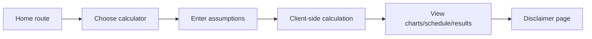
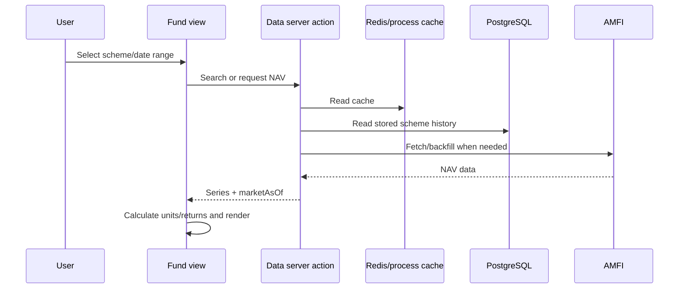

# User Journeys

Status: Reconstructed from routes/components/actions; manual UX verification NOT
PERFORMED Source: `src/app/`, `src/components/AppClientLayout.tsx`,
`src/context/`, `src/actions/` Last Verified: 2026-10-08 Confidence: MEDIUM
Owner: UNKNOWN Related Documents:
[Product inventory](PRODUCT_AND_FEATURE_INVENTORY.md),
[auth security](AUTH_SECURITY.md), [API catalog](API_CATALOG.md)

## Public Calculator

Exact persisted state varies by calculator. Some tools fetch external reference
data; some save user state after login. Do not assume every calculation stays
only in the browser.

## Mutual Fund Analysis

Fund search (`useFundSearch`) matches every typed word against word boundaries
in the scheme name, ignoring tokens with no letters or digits, so pasting a full
name such as "Kotak Arbitrage Fund - Direct Plan - Growth" still finds the
scheme. On the PPF comparison, "Select Other Mutual Funds" opens the selector
with an empty search; the current fund stays visible as the pinned chip.

## Login / Subscription

User chooses password or Google sign-in. Server creates/looks up user and a
30-day session token; browser stores token in local storage. Auth context
refreshes current user, tracks usage, and may show paywall. Upgrade can create
Razorpay order and call verification or submit UPI UTR for admin approval.
Payment flow needs security review for order/plan binding.

## Admin Operations

Admin signs into app or supplies token where action supports `ADMIN_SYNC_TOKEN`;
dashboard dispatches specific server actions and sync routes. Each action has
separate authorization. Do not assume all admin routes share one guard.

## Games

User opens a game route, plays locally, starts a server game session, submits
result; server checks session age/owner/game/time/limits and writes score. The
route-based `/api/leaderboard` is a mock; hub data uses server actions.

## Error/Recovery

Root error, route error, not-found and loading components exist. Exact recovery
path depends on route/provider. External data often falls back to stored/default
results; users may not receive a uniform freshness indicator. See
`DATA_FRESHNESS.md` and `OPERATIONS_RUNBOOK.md`.

AI and privacy-sensitive flow: Tax user summary/question -> entitlement check ->
configured prompt -> Gemini -> free-text response. A complete in-product
disclosure/consent journey was not verified.
